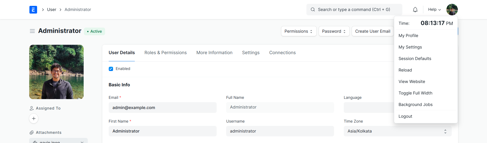
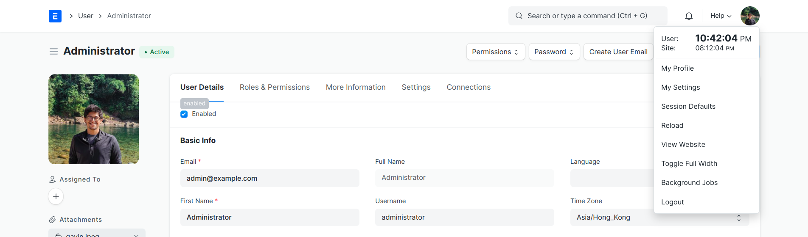
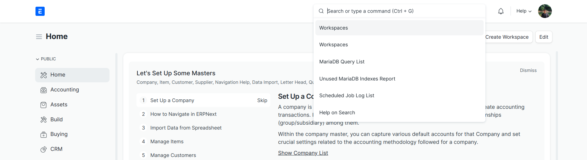

## Desk Navbar Extended

Tweaks in Desk's Navbar to boost Productivity

[](https://frappecloud.com/marketplace/apps/desk_navbar_extended?referrer=a6d8da54)

### Features

1. **Enterprise desk clock** – configurable via *Desk Navbar Extended Settings* with role-scoped toggles, additional world clocks, and live calendar excerpts in the navbar dropdown.
2. **Production voice search** – microphone control adjacent to the awesomebar with Web Speech API integration, MediaRecorder fallback, and background transcription queueing.
3. **Configurable awesomebar layout** – width, mobile collapse behaviour, and optional analytics instrumentation exposed through the settings singleton and dedicated metrics dashboard.
4. **Telemetry workspace** – administrators receive a workspace card summarising `Desk Navbar Search Metric` entries with realtime alerts when error rates spike.


*When User & Site TimeZones Match*


*When User & Site TimeZones are Different*



### Configuration

All capabilities are managed through **Desk Navbar Extended Settings** (single doctype). Key options include:

- Enable or disable the clock, voice search, and wide awesomebar features per role.
- Choose 12h/24h formatting, calendar excerpts, and add unlimited custom time zones with colour accents.
- Configure awesomebar width, mobile collapse, and opt-in usage analytics.

Voice search background transcription expects the following environment variables in `site_config.json`:

- `desk_navbar_transcription_endpoint` – HTTPS endpoint that receives base64 audio payloads.
- `desk_navbar_transcription_api_key` – API token forwarded to the external transcription service.

Without these values the job logs a warning and retains the recording for manual follow-up.

### Testing

Run the Python tests inside a bench with the app installed:

```bash
bench --site test_site run-tests --app desk_navbar_extended desk_navbar_extended.tests.test_api
```

For client-side assertions, include `desk_navbar_extended/public/js/tests/voice_search.test.js` in your QUnit bundle.

#### License

MIT
